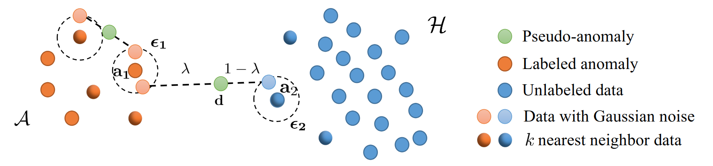

# NNG-Mix

This repository contains the implementation of the paper:

**NNG-Mix: Improving Semi-supervised Anomaly Detection with Pseudo-anomaly Generation**  
[Hao Dong](https://sites.google.com/view/dong-hao/), Gaëtan Frusque, [Yue Zhao](https://viterbi-web.usc.edu/~yzhao010/), [Eleni Chatzi](https://chatzi.ibk.ethz.ch/about-us/people/prof-dr-eleni-chatzi.html) and [Olga Fink](https://people.epfl.ch/olga.fink?lang=en)  
[Link]() to the arXiv version of the paper is available.

We investigate improving semi-supervised anomaly detection performance from a novel viewpoint, by generating additional pseudo-anomalies based on the limited labeled anomalies and a large amount of unlabeled data. We introduce NNG-Mix, a simple and effective pseudo-anomaly generation algorithm, that optimally utilizes information from both labeled anomalies and unlabeled data.

Nearest Neighbor Gaussian Mixup (NNG-Mix) makes good use of information from both labeled anomalies and unlabeled data to generate pseudo-anomalies effectively.

## Abstract
Anomaly detection (AD) is essential in identifying rare and often critical events in complex systems, finding applications in fields such as network intrusion detection, financial fraud detection, and fault detection in infrastructure and industrial systems. While AD is typically treated as an unsupervised learning task due to the high cost of label annotation, it is more practical to assume access to a small set of labeled anomaly samples from domain experts, as is the case for semi-supervised anomaly detection. Semi-supervised and supervised approaches can leverage such labeled data, resulting in improved performance. In this paper, rather than proposing a new semi-supervised or supervised approach for AD, we introduce a novel algorithm for generating additional pseudo-anomalies on the basis of the limited labeled anomalies and a large volume of unlabeled data. This serves as an augmentation to facilitate the detection of new anomalies. Our proposed algorithm, named Nearest Neighbor Gaussian Mixup (NNG-Mix), efficiently integrates information from both labeled and unlabeled data to generate pseudo-anomalies. We compare the performance of this novel algorithm with commonly applied augmentation techniques, such as Mixup and Cutout. We evaluate NNG-Mix by training various existing semi-supervised and supervised anomaly detection algorithms on the original training data along with the generated pseudo-anomalies. Through extensive experiments on 57 benchmark datasets in ADBench, reflecting different data types, we demonstrate that NNG-Mix outperforms other data augmentation methods. It yields significant performance improvements compared to the baselines trained exclusively on the original training data. Notably, NNG-Mix yields up to 16.4%, 8.8%, and 8.0% improvements on Classical, CV, and NLP datasets in ADBench.

## Code
The code will be available soon.